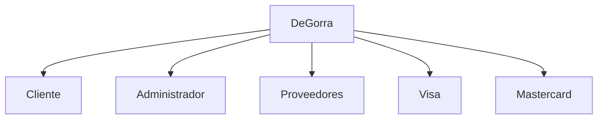
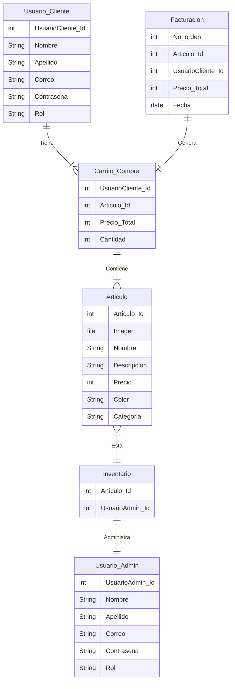
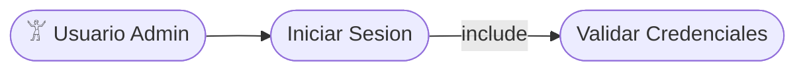
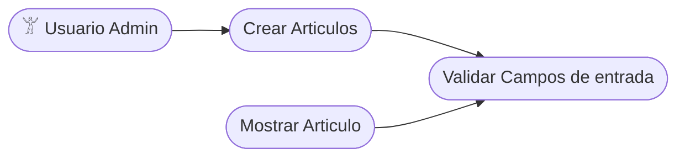
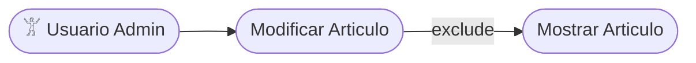
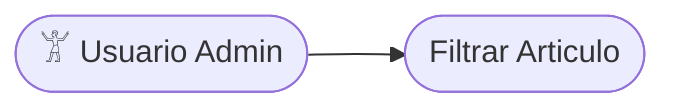
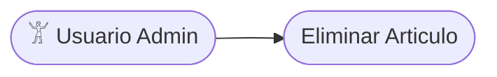

# Degorra
Tienda virtual de venta de gorras
<h1>Introducción</h1>

El proyecto Degorra es un conjunto de elementos orientados a generar una solución óptima para la misma, haciendo uso de diversas herramientas que permiten resolver las dificultades que presentan los procesos desarrollados en el establecimiento tales como: Pedidos por parte del cliente, visualización de estos en la tienda y control de inventarios. Planteando un servicio de MarketPlace para aquellos emprendedores de venta de gorras que no tienen acceso a una tienda propia.

<h1>Arquitectura de software</h1>

Una vez realizado el alcance, analizando el objetivo, la problemática y el diagrama de contexto, se determina que la arquitectura que se empleará para el presente proyecto es por capas, esta arquitectura es una aplicación web típica que está compuesta por una capa de presentación (funcionalidad relacionada con la interfaz de usuario), una capa de negocios (procesamiento de reglas de negocios) y una capa de datos (funcionalidad relacionada con el acceso a datos).

<h1>Lenguajes de programación y herramientas</h1>

Para el presente proyecto se usarán las siguientes herramientas y lenguajes de programación:
1.	Back-end – Framework Django
2.	Front-end - React
3.	Bases de datos - Posgress
4.	Cloud base de datos - Heroku
5.	Lenguajes de programación – Python, HTML y CSS
6.	Diseño de Mockups – ADOBE X
7.	Diseño de diagramas Draw.io
8.	Trabajo colaborativo del equipo de proyecto 
GITHUB - https://github.com/ingcdsantamaria/Degorra

<h1>Requerimientos funcionales</h1>
<h2>RF_001 Version 1.0</h2>

PROYECTO	DEGORRA		
ID	RF_001	VERSIÓN	1.0
AUTOR	Cristian Aldebó fernández		
TITULO	COMO 		Usuario funcional
	QUIERO	<Objetivo>	Acceder al software y conectar con la base de datos
	PARA	<Beneficio>	Para acceder a todas las funcionalidades del software
DESCRIPCIÓN	Precondición	 Para acceder al software y realizar la conexion con la base de datos, debe conocer su usuario y contraseña para ingresar	
	Regla de Negocio	Sera considerado usuario si tiene credenciales de acceso	
	Datos de Entrada	Usuario y contrasena	
CRITERIOS DE ACEPTACIÓN	ID ESCENARIO	ACCESO 	
	DESCRIPCIÓN 	DADO QUE	Quiero acceder como usuario al software
		CUANDO	Cuando sea necesario su uso
		ENTONCES	Ingreso mis credenciales para hacer uso del sofware
	ID ESCENARIO	CONEXION A LA BASE DE DATOS	
	DESCRIPCIÓN 	DADO QUE	Quiero acceder a la base de datos
		CUANDO	Al acceder con mis credenciales
		ENTONCES	Debo acceder con mis credenciales para poder conectar con la base de datos
PRIORIDAD	Alta		
TRABAJO RELACIONADO	Creacion de nuevo usuario en el sistema		

<h2>RF_002 version 1.0</h2>

PROYECTO	DEGORRA		
ID	RF_002	VERSIÓN	1.0
AUTOR	Cristian Aldebo Fernandez		
TITULO	COMO 	Usuario	Usuario funcional
	QUIERO	<Objetivo>	Ingresar articulos a la tienda online
	PARA	<Beneficio>	Para incluir nuevos articulos a la tienda online
DESCRIPCIÓN	Precondición	Debo estar correctamente logeado con mi usuario y contrasena	
	Regla de Negocio	Para ingresar nuevo articulo debe tener todos los campos solicitados y foto del producto	
	Datos de Entrada	Especificaciones, nombre, color, cantidad y foto del producto	
CRITERIOS DE ACEPTACIÓN	ID ESCENARIO	Ingreso de artículos	
	DESCRIPCIÓN 	DADO QUE	quiero ingresar articulos al portafolios
		CUANDO	Cuando tenga nuevos productos
		ENTONCES	Debo tener todos los datos solicitados para incluir el producto
	ID ESCENARIO		
	DESCRIPCIÓN 	DADO QUE	quiero ingresar articulos al portafolios
		CUANDO	Cuando tenga nuevos productos
		ENTONCES	Al agregar un nuevo producto, debe mostrar el articulo agregado en 3 segundos
PRIORIDAD	Alta		
TRABAJO RELACIONADO	Acceso con Usuario y contraseña a la tienda online		

<h2>RF_003 version 1.0</h2>

PROYECTO	DEGORRA		
ID	RF_003	VERSIÓN	1.0
AUTOR	Cristian aldebó fernández		
TITULO	COMO 	<rol>	usuario funcional
	QUIERO	<Objetivo>	Modificar articulos de mi portafolio de productos
	PARA	<Beneficio>	tener actulizado los productos en la tienda online
DESCRIPCIÓN	Precondición	Tener productos en la tienda que para modificar	
	Regla de Negocio	Tener como minimo un artículo para poder modificarlo	
	Datos de Entrada	Tener los datos a modificar del artículo	
CRITERIOS DE ACEPTACIÓN	ID ESCENARIO	Modificación de artículos	
	DESCRIPCIÓN 	DADO QUE	Quiero modificar productos 
		CUANDO	cuando tenga cambios en algún articulo de la tienda
		ENTONCES	Debo tener los nuevos datos del artículo para modificarlos
	ID ESCENARIO		
	DESCRIPCIÓN 	DADO QUE	Quiero modificar productos 
		CUANDO	cuando tenga cambios en algún articulo de la tienda
		ENTONCES	El producto una vez realizados los cambios, en menos de 3 segundos debe aparecer actualizado
PRIORIDAD	Media		
TRABAJO RELACIONADO	Debo tener mínimo un articulo para poder modificarlo		

<h2>RF_004 version 1.0</h2>

PROYECTO	DEGORRA		
ID	RF_004	VERSIÓN	1.0
AUTOR	Cristian Aldebó Fernández		
TITULO	COMO 	<rol>	Usuario funcional
	QUIERO	<Objetivo>	Quiero filtrar los articulos
	PARA	<Beneficio>	Para poder realizar una gestion mas eficiente  de mis articulos 
DESCRIPCIÓN	Precondición	Deben haber más de un artículo en la tienda para poder filtrar	
	Regla de Negocio	Los articulos deben llevar las especificaciones para poder realizar los filtros por color, y marca	
	Datos de Entrada	El usuario debe determinar que tipo de filtro debe realizar	
CRITERIOS DE ACEPTACIÓN	ID ESCENARIO	Filtrado de artículos	
	DESCRIPCIÓN 	DADO QUE	quiero filtrar productos
		CUANDO	Cuando esté buscando articulos
		ENTONCES	Los articulos deben tener las especificaciones y debe haber más de un producto
	ID ESCENARIO		
	DESCRIPCIÓN 	DADO QUE	quiero filtrar productos
		CUANDO	Cuando esté buscando articulos
		ENTONCES	El filtrado de productos debe mostrar en pantalla el resultado en menos de 2 segundos
PRIORIDAD	Media		
TRABAJO RELACIONADO	El usuario debe tener ingresados más de un artículo con todas las especificaciones		

<h2>RF_005 version 1.0</h2>

PROYECTO	DEGORRA		
ID	RF_005	VERSIÓN	1.0
AUTOR	Cristian Aldebó Fernández		
TITULO	COMO 	<rol>	Usuario funcional
	QUIERO	<Objetivo>	Eliminar productos de la tienda online
	PARA	<Beneficio>	Eliminar productos que no tengo en stock
DESCRIPCIÓN	Precondición	Deben haber productos en la tirenda para eliminar	
	Regla de Negocio	Para eliminar un producto el software preguntara si quiere eliminar definitivamente el producto	
	Datos de Entrada	los datos del producto a eliminar 	
CRITERIOS DE ACEPTACIÓN	ID ESCENARIO	Eliminación de articulos	
	DESCRIPCIÓN 	DADO QUE	Quiero eliminar productos
		CUANDO	No tenga stock del artículo
		ENTONCES	Se eliminará el producto de forma inmediata
	ID ESCENARIO		
	DESCRIPCIÓN 	DADO QUE	Quiero eliminar productos
		CUANDO	No tenga stock del artículo
		ENTONCES	El  SW lanzará una casilla indicando si quiere eliminar definitivamente el producto
PRIORIDAD	Media		
TRABAJO RELACIONADO	Ingreso de productos en la tienda virtual		

### Problematica:

- Las labores repetitivas que no son sistematizadas en un establecimiento suelen demandar más tiempo, comprometen la calidad del servicio y pueden generar inconformidad en los clientes. La ausencia de un sistema eficiente para automatizar los pedidos y controlar el inventario para los insumos utilizados en la venta de sus productos en los establecimientos de ropa afecta su eficacia para atender a sus clientes.

### Diagrama de Contexto:

- EL siguiente diagrama definira los límites entre el sistema DeGorra y su ambiente, mostrando las entidades que interactúan con él:

### Diagrama de Entidad de Relaciones: 

Un diagrama entidad-relación, también conocido como modelo entidad relación o ERD, es un tipo de diagrama de flujo que ilustra cómo las "entidades", como personas, objetos o conceptos, se relacionan entre sí dentro de un sistema. Los diagramas ER se usan a menudo para diseñar o depurar bases de datos relacionales en los campos de ingeniería de software, sistemas de información empresarial, educación e investigación.

### Diagrama de Casos de Uso: 
Requerimiento Funcional 1(RF_001): 

Requerimiento Funcional 2(RF_002): 

Requerimiento Funcional 3(RF_003): 

Requerimiento Funcional 4(RF_004): 

Requerimiento Funcional 5(RF_005): 

