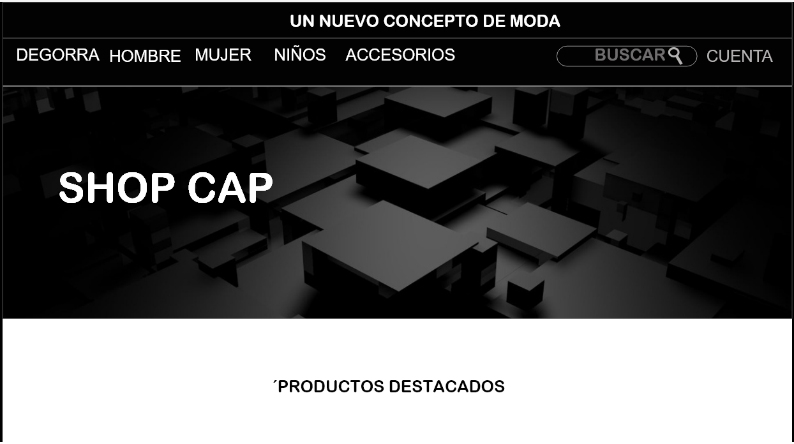
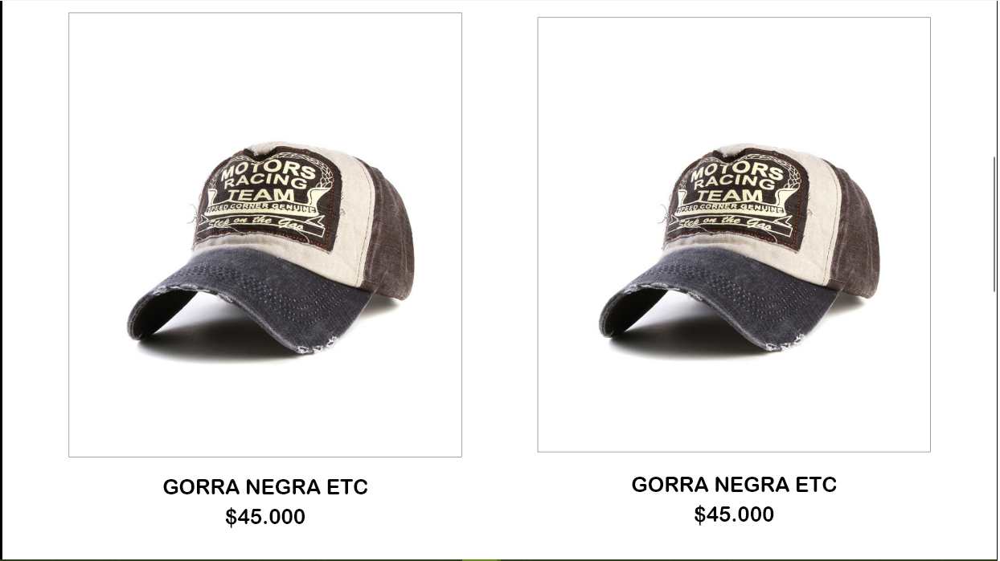
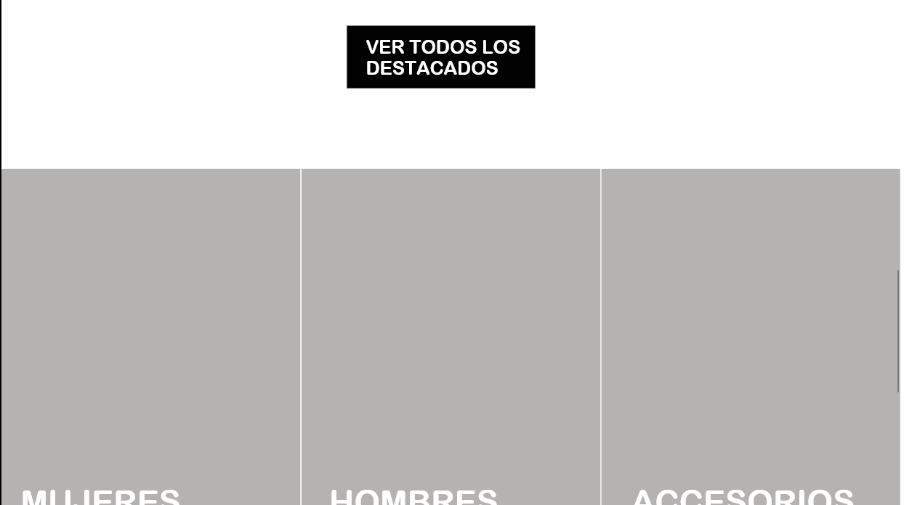
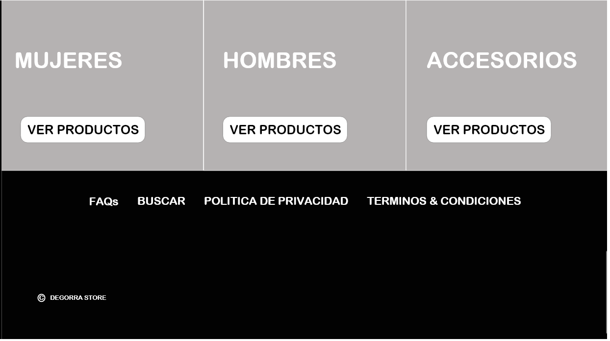
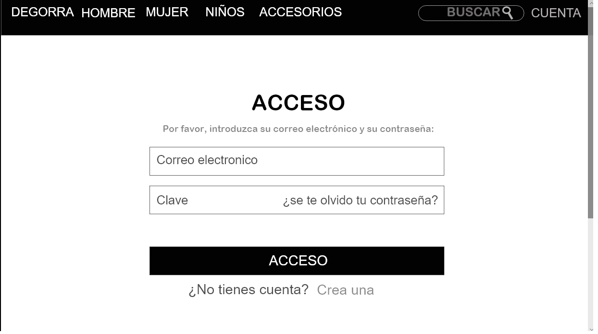
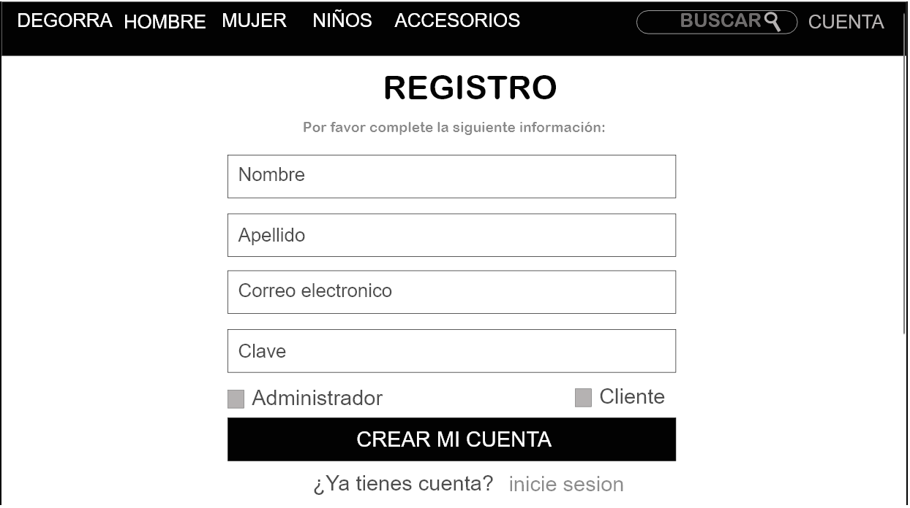
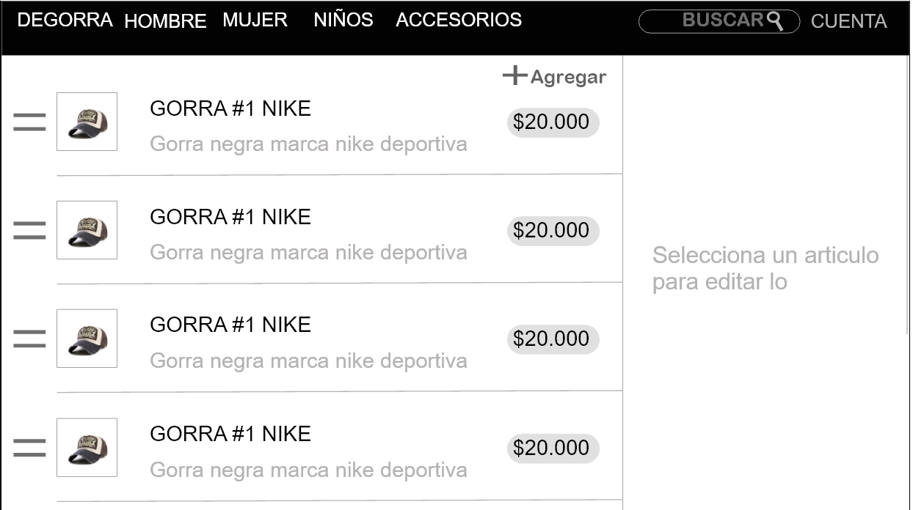
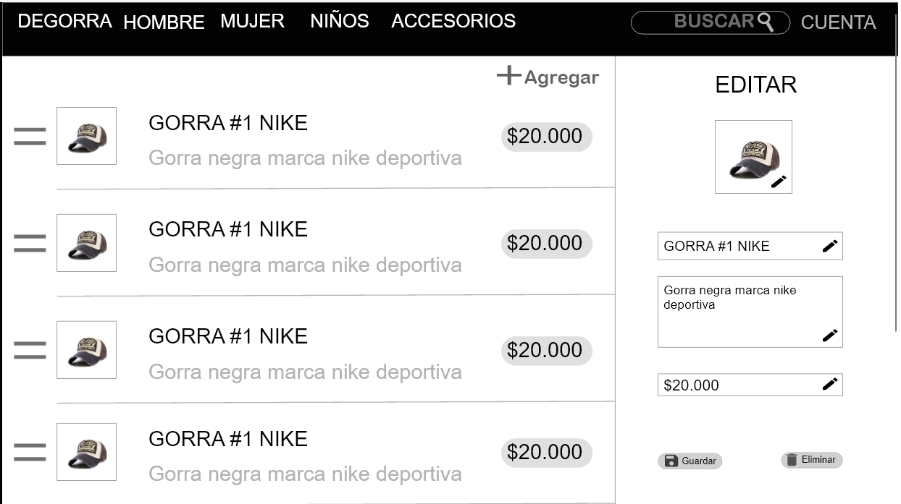

# Degorra
Tienda virtual de venta de gorras

***
### Objetivo general:

- Diseñar un modelo de tienda virtual de gorras que maneje un sistema multinivel permitiendo al usuario realizar consultas y obtener los servicios del sitio Web

### Objetivos específicos:

- Diseñar una base de datos práctica y segura para la consulta de
información.
- Crear una base de datos de Imágenes para que los clientes puedan
ver la variedad de productos.
- Permitir al usuario adquirir los pedidos mediante un proceso de
Inscripción al sitio.
- Ofrecer servicios de multimedia y consultas específicas.
***
## MOCKUPS

- Mockups - XD Se presentan 18 Mockups elaborados en la plataforma Adobe XD. también pueden ser consultados en el siguiente link:
  -  [Mockups url](https://xd.adobe.com/view/ec0aa48f-f86a-463f-853e-46ff2884694b-b959/screen/cbeef32c-954d-43b6-8da0-ba0c94ec65f8/ "Mockups url")

  - Ventana principal

  - Ventana Login

  - Ventana Register

  - Ventana Admin CRUD

