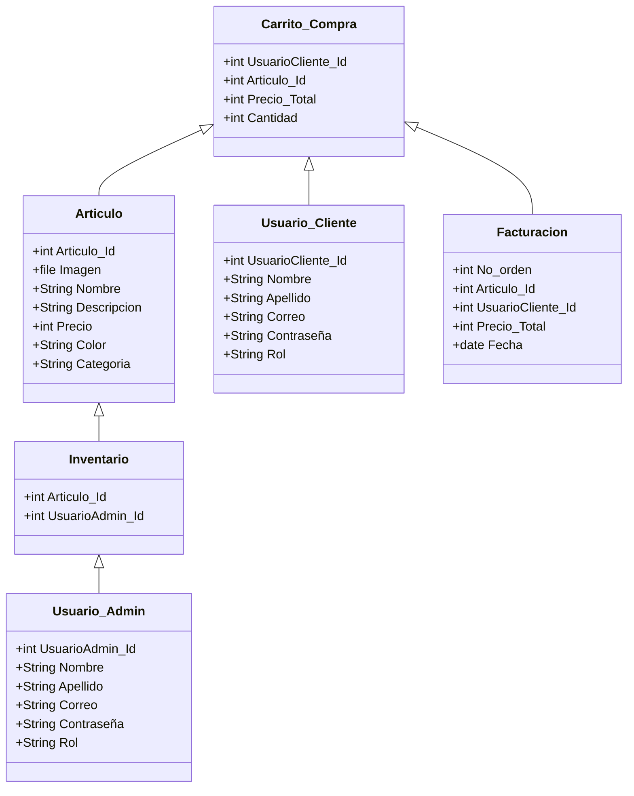

# Degorra
Tienda virtual de venta de gorras

### Problematica:

- Las labores repetitivas que no son sistematizadas en un establecimiento suelen demandar más tiempo, comprometen la calidad del servicio y pueden generar inconformidad en los clientes. La ausencia de un sistema eficiente para automatizar los pedidos y controlar el inventario para los insumos utilizados en la venta de sus productos en los establecimientos de ropa afecta su eficacia para atender a sus clientes.

### Diagrama de Contexto:

- EL siguiente diagrama definira los límites entre el sistema DeGorra y su ambiente, mostrando las entidades que interactúan con él:

### Diagrama de Entidad de Relaciones: 

Un diagrama entidad-relación, también conocido como modelo entidad relación o ERD, es un tipo de diagrama de flujo que ilustra cómo las "entidades", como personas, objetos o conceptos, se relacionan entre sí dentro de un sistema. Los diagramas ER se usan a menudo para diseñar o depurar bases de datos relacionales en los campos de ingeniería de software, sistemas de información empresarial, educación e investigación.

